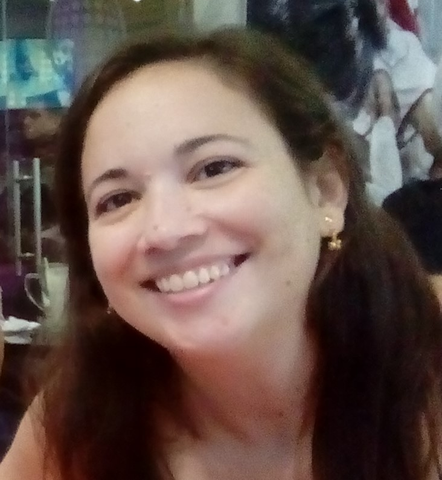

## About us

Welcome to the team page! Here you can learn about the authors behind the project.

  

    
    <h3>Beatriz Rodríguez Hernández</h3>
    
Bety is the creator of the project and developed the original concept and research questions behind it. Her work includes the development of the survey instruments, data analysis strategies, and the interpretation of findings. With a strong commitment to understanding the academic and professional journeys of Physics graduates — particularly from a gender perspective — Bety brings both academic insight and personal motivation to the initiative.

  

  

    
    <h3>Gretel Quintero Angulo</h3>
    
Brief description about Author 2 and their role in the project.

  

  

    
    <h3>Duvier Suárez Fontanella</h3>
    
Brief description about Author 3 and their role in the project.

  

